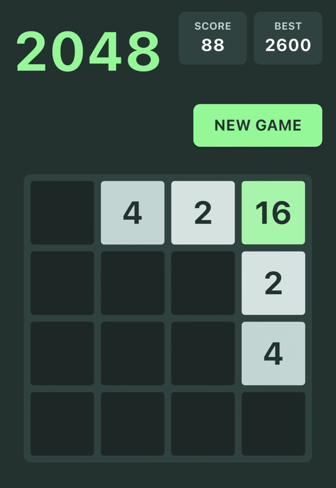

# 2048

  

A polished 2048 puzzle game for iOS built with ***plain using Flutter and the Flame game engine.

## Overview

Slide numbered tiles on a 4x4 grid. When two tiles with the same value collide, they merge into one tile with double the value. Reach the 2048 tile to win — or keep going for a higher score.

## Tech Stack

- **Language:** Dart / Flutter
- **Game Engine:** Flame
- **Platform:** iOS
- **Persistence:** SharedPreferences (local best score)

## Features

- Swipe controls (up, down, left, right) with drag gesture detection
- Smooth tile slide, merge pop, and spawn animations
- Score tracking with persisted best score
- Game over detection and win dialog at 2048
- Custom color palette: green (#79fc96), lime (#e0ff6e), dark teal (#223936), light sage (#c5dcd9)

## Project Structure

This project is built using ***plain specifications. 

| File | Purpose |
|------|---------|
| `game2048.plain` | Main spec file with definitions, functional specs, and acceptance tests |
| `template/flutter-flame.plain` | Shared template for Flutter + Flame stack |

## License

This project is licensed under the [MIT License](LICENSE).
